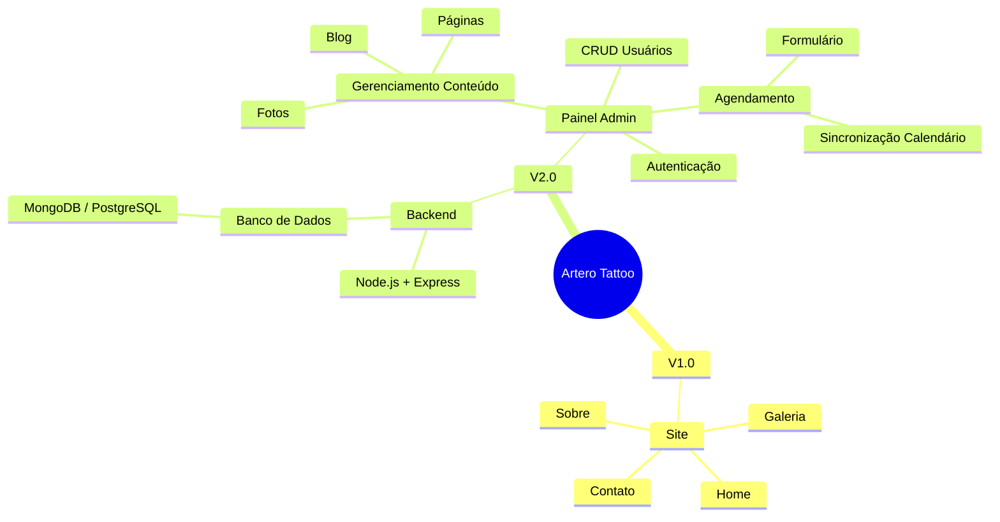

# Artero Tattoo - Estrutura de Desenvolvimento


## Visão Geral
Este repositório contém a estrutura de desenvolvimento para o site do estúdio **Artero Tattoo**, do Rafael Artero. Nele estão definidos dois grandes marcos:

1. **Versão 1.0** – Site simples e rápido para apresentação online do estúdio.
2. **Versão 2.0** – Evolução com backend, painel administrativo e sistema de agendamentos.

---

## Tabela de Conteúdos

- [Versão 1.0](#versão-10)
- [Versão 2.0](#versão-20)
- [Estrutura de Pastas](#estrutura-de-pastas)
- [Tecnologias Utilizadas](#tecnologias-utilizadas)
- [Como Executar (V1)](#como-executar-v1)
- [Roadmap Futuro](#roadmap-futuro)
- [Mapa Mental do Projeto](#mapa-mental-do-projeto)
- [Licença](#licença)

---

## Versão 1.0
### Objetivo
Criar um site promocional e de contato para o Artero Tattoo, focado em:

- Landing page com identidade visual forte.  
- Galeria de fotos dos trabalhos concluídos.  
- Seção "Sobre" contando a história do Rafael.  
- Formulário de contato rápido.

### Tecnologias

- **Next.js** (React framework para SSR/SSG)  
- **Tailwind CSS** (estilização utilitária rápida)  
- **Vercel** (deploy contínuo) ou **Netlify**  

### Estrutura de Pastas

```
artero-tattoo/
├─ public/              # Imagens, favicon, logo-temporario.png
├─ styles/              # Arquivos CSS/Tailwind
├─ pages/               # Rotas Next.js (index.js, sobre.js, contato.js)
├─ components/          # Header, Footer, Gallery, ContactForm
├─ next.config.js       # Configurações Next.js
└─ tailwind.config.js   # Configurações Tailwind
```

### Como Executar (V1)

1. Clone este repositório:
    ```bash
    git clone https://github.com/seu-usuario/artero-tattoo.git
    cd artero-tattoo
    ```
2. Instale dependências:
    ```bash
    npm install
    ```
3. Rode em modo de desenvolvimento:
    ```bash
    npm run dev
    ```
4. Acesse `http://localhost:3000` no navegador.

---

## Versão 2.0
Nesta fase o projeto receberá:

- **Banco de Dados** (MongoDB ou PostgreSQL).  
- **Backend** em Node.js + Express, expondo API REST.  
- **Painel Administrativo** para:
  - Cadastro e autenticação de usuários (JWT / OAuth).  
  - Gerenciamento de fotos de trabalho.  
  - Publicação e edição de posts no blog.  
  - Edição de páginas "Sobre" e outras estáticas.  
  - Sistema de agendamento de sessão de tatuagem, com:  
     - Formulário de reserva.  
     - Sincronização com o calendário do Rafael (Google Calendar API).

### Tecnologias Previstas

- **Node.js** + **Express**  
- **Prisma** ou **Mongoose** (ORM/ODM)  
- **Next.js API Routes** ou **NestJS** (opcional)  
- **React Admin** ou dashboard customizado  
- **Google Calendar API** para integrações

---

## Roadmap Futuro

1. Autenticação social (Google/Facebook).  
2. SEO avançado e otimização de performance.  
3. Notificações por e-mail (Nodemailer).  
4. PWA para clientes acessarem agendamentos pelo celular.  

---

## Mapa Mental do Projeto



---

## Licença

Este projeto está sob a licença **MIT**. Sinta-se à vontade para adaptar e contribuir!  # arterotattoo
